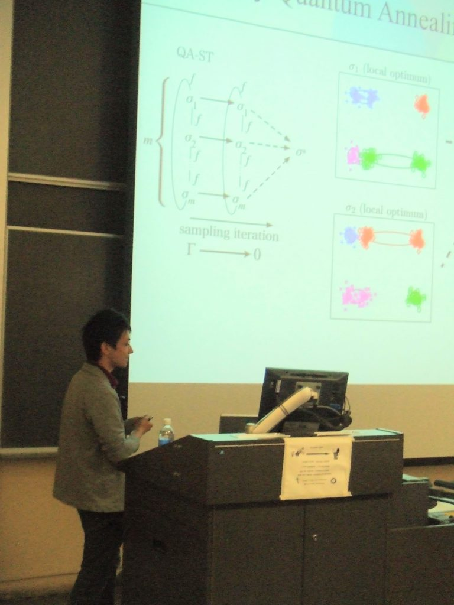

## 栗原賢一

- kenichi.kurihara@gmail.com
- [Twitter](https://twitter.com/kenichikurihara)
- [Linkedin](https://www.linkedin.com/in/kenichi-kurihara-14361a12/)
- [履歴](https://docs.google.com/document/u/1/d/e/2PACX-1vSUmg3dw-h2cd5oQvna3JRh4ZU-2E647EWv5mHwKWCowi1I6roGrcl7VScHeO2mwGTldqmxvaqM6Nt8/pub)
- [学術論文](https://docs.google.com/spreadsheets/u/1/d/e/2PACX-1vQr8O01B0E7ha1s85D9zryhGEFiM5-tE-S3b_YhYefwLtJfgIqTAZPf3YwVAig7GsckrWAh0fvJkPPp/pubhtml?gid=0&single=true) (個人で管理)
    - [Google Scholarのリスト](https://scholar.google.com/citations?user=d8NF-6IAAAAJ)

<figure class="wp-block-image size-large"><figcaption>UAI 2009</figcaption></figure>

## 論文で使用したソフトウェア

- [Variational Dirichlet Process Gaussian Mixture Model](variational-dirichlet-process-gaussian-mixture-model.html)
- [Bayesian K-Means](bayesian-k-means.html)

## [English version](about-me.html)